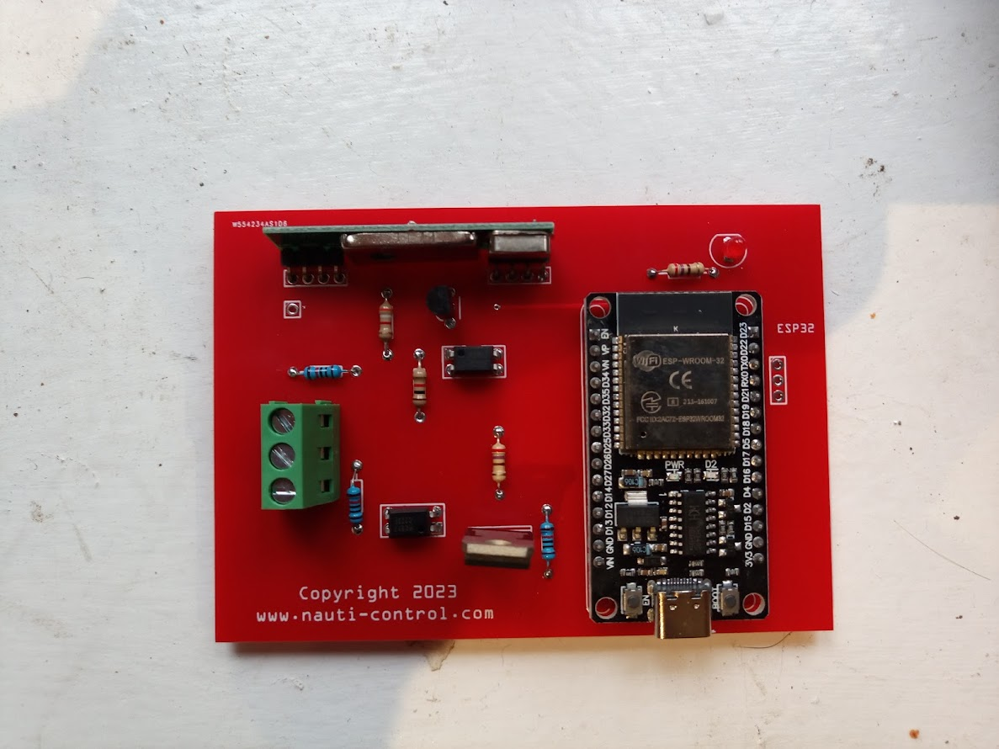
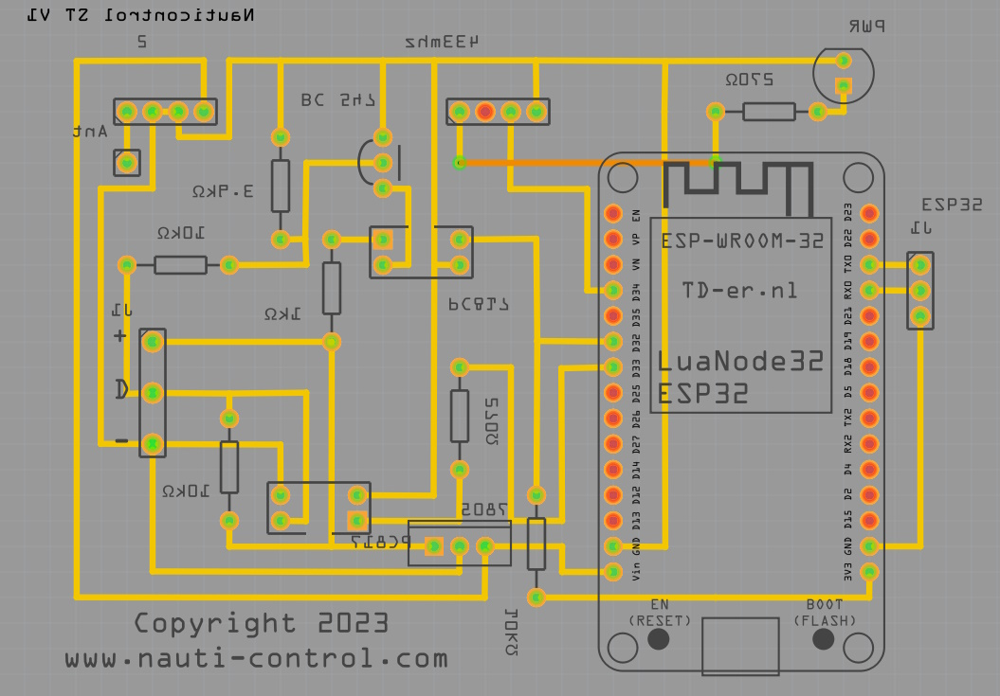
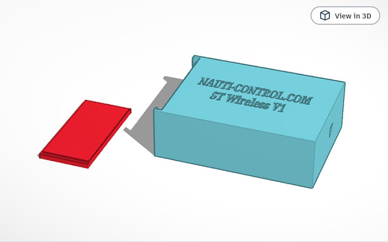

# ST Wireless Remote Controller

Open Source Wireless remote for Raymarine Seatalk  autopilotsincluding ST1000/ST2000. Compatible with all devices that work with the Raymarine S100, also controls other insturments such ST60 speed timer. Allows controlling of autopilot and various raymarine displays using 433mhz remote as well as mobile/tablet using built in WIFI Access Point. 

Aside from the remote functionality the connection to the seatalk bus allows us to read signals and decode other instrument data such as wind, speed , depth etc . Currently developing Seatalk -> NMEA 183 TCPIP transposer to allow Open CPN (and other such applications) to use the seatalk data , this would be done again over the wireless connection. This is currently under development . Other ideas for the future include a man over board mode where it'll set the heading nose to wind . These will be documented once completed on the main https://www.nauti-control.com website.

See how to setup box and demo on our youtube channel.
https://youtu.be/EBTYceL7NpY

# Compatibility

Works with all auto pilots that use classic Seatalk interface.

ST4000,ST4000+,ST5000,ST5000+,ST6000,ST6000+,ST6001,ST6001+,ST6002,ST6002+,ST7000,ST7000+,ST7001+,ST7002,ST7002+,ST8001,ST8001+,ST8002,ST8002+RayPilot 650

ST1000,ST1000+,ST2000,ST2000+

ST3000,ST4000,ST5000,ST6000,ST7000,Autohelm Sport pilot,Autohelm Sport pilot +
 
Type 100,Type 300,Type 150,Type 400,S1000,Sport pilot,sport pilot +,Smartpilot: S1,S1G,S2,S2G,S3,S3G,SP1,SPX5,SPX10 ,SPX30,SPX40,ST70P

ST60 Speed + Tri Data Displays (Timer)

Also works with newer autopilots with additional adapter for Seatalk 1 to Seatalk NG

https://www.raymarine.com/en-us/our-products/networking-and-accessories/seatalk/seatalk-1-to-seatalk-ng-convertor

Evolution EV100 , 150, 200 , 300 & 400

# Software
The code is written in C++ using platform IO . I use Visual Code as my editor . The firmware uses soft serial with the parity bit acting at the 9th bit that seatalk protocol uses.  The seatalk datagrams I have been using an excellent technical guide by Thomas Knauf http://thomasknauf.de/rap/seatalk2.htm . There is two parts to the code 1. The main firmware 2. A mini web application for settings the button mapping settings as well as allowing the device to be controlled from a mobile device . This is written to the esp32 spiffs. These get built and uploaded to the ESP32 seperately from with the platform IO extension in Visual Code.

# Hardware

The PCB design is fairly simple and uses an ESP32 devkit 30 pin board along with optocouplers to provide some isolation between the seatalk 12v and 3.3v of the ESP32 . A 7805 is used to drop the 12v down to 5v to feed the ESP32 . I found using 12v directly on the vin caused major issues and burnt out the onboard regulator on certain boards . The 7805 does get quite hot but i've done a burn in test for several weeks continious use and no issues on the bench. The receiver is a RXb6 and the current firmware has support for mapping to 8 buttons the different remote functionality. 

THe circuit design was created using the open source fritzing tool and source file is available in the repo along with generated gerbers used for making the PCBs . 

The case design was created using tinker cad and you can view the original here https://www.tinkercad.com/things/47GMuNnkxJl-nauticontrol-seatalk?sharecode=v9_ytJjsey86pV6xQheSngRRn7UYJ45ZI_IGC7HBws0  

STLS are included in the repo and ready to 3D print.

You can purchase a fully hand built Wireless Controller from our online store which will help support ongoing development and new features  
https://nauti-control.com/product/st-wireless-controller-fully-built-with-4-button-remote/ 
This includes a remote , 3d printed case and fully built PCB with latest firmware pre-installed , just plug into your seatalk system and go. 

Bill Of Materials with links that will support on going development through affiliation or direct purchase.

1 x PCB - https://nauti-control.com/product/st-wireless-remote-controller-pcb/ 
1 x ESP32 - https://s.click.aliexpress.com/e/_DD5c10v  
1 x RXB6 433Mhz Superheterodyne Receiver - https://s.click.aliexpress.com/e/_DCJstw9  
1 x 4 Button Remote https://nauti-control.com/product/4-button-wireless-remote-for-st-wireless-remote-controller/ 
1 x 7805 Voltage REgulator - https://s.click.aliexpress.com/e/_DBNSCGH  
1 x BC547 Transister - https://s.click.aliexpress.com/e/_DCKfQwp  
2 x 270ohm 1/4W Resistor - https://s.click.aliexpress.com/e/_DkgFIJ7  
1 x 1kohm 1/4 Resistor - https://s.click.aliexpress.com/e/_DkgFIJ7  
1 x 3.9kohm 1/4 Resistor -https://s.click.aliexpress.com/e/_DkgFIJ7  
3 x 10kohm 1/4 Resistor - https://s.click.aliexpress.com/e/_DkgFIJ7  
2 x PC817 Optocoupler -https://s.click.aliexpress.com/e/_DEU20qv  
1 x PCB Terminal Block 5.00mm pitch - https://s.click.aliexpress.com/e/_DFGZrcp  
1 x 433mhz Antenna https://s.click.aliexpress.com/e/_DDclB9J  

Donate to support on going development and features.
https://nauti-control.com/donate/

# Disclaimer
I provide all hardware and software without liability or gaurantees as expressed by the GPL licence this has been released under  

To avoid risk of damage ensure wiring is done correctly and while the system is off to avoid shorting or reverse polarity.

# Follow us on socials.

https://www.facebook.com/nauti-control/ 
https://www.instagram.com/nauticontrol 
https://www.youtube.com/@nauti-control/  

# Facebook Support Group
https://www.facebook.com/groups/307695028303840 

